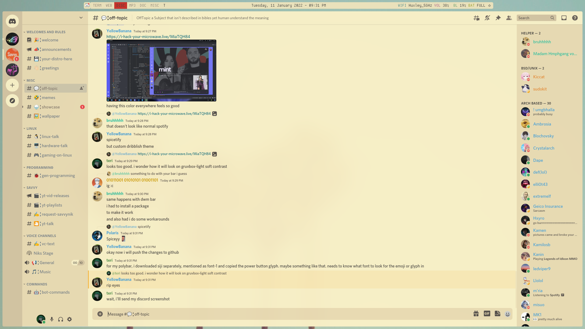

# gruvbox-light-bspwm
* Am bored, so decided to make a repo out of my dotfiles.
* Also useful in case I switch WMs or DEs and want to come back to my old setup.

# Preview
* Desktop preview

* Neofetch preview

* Discord

# Details
* OS: Arch
* WM: bspwm
* Terminal: urxvt
* Fonts: `dina-font-ttf` and `siji-ng` (for polybar power button).
All fonts are from AUR
* X compositor: `picom-ibhagwan-git` from AUR
* Wallpaper: Can be found in Pictures folder
* Neofetch script: Edited by me, only works for me.
* Neofetch picture: Downloaded from a random website I can't even recall or find again.
* Discord theme: Custom script called `discocss` from AUR
* CSS for discord: Duvbox
